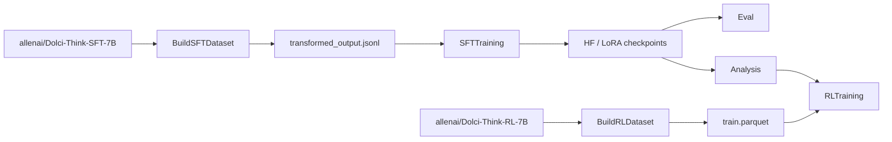

# DecomposedReasoning

DecomposedReasoning is an end-to-end research stack for studying reasoning
traces that separate **steering** from **execution**.

The repo starts from Dolci Think-style supervised and RL datasets, rewrites
`<think>` regions into structured `<steer>/<exec>` traces, trains checkpoints on
that structure, evaluates them on math benchmarks, and then tests whether
generation can be improved by branching at steer boundaries and selecting among
candidate reasoning directions.

This README is the orientation layer. Each subproject has its own README for the
deep operator details.

## Mental Model



The main idea is that a reasoning trace can be treated as alternating decisions:

```text
<steer>choose the next reasoning move</steer>
<exec>carry that move out in object-level math or text</exec>
```

That structure gives the repo three linked experimental surfaces:

- **Data**: convert and augment ordinary thinking traces into steer/exec traces.
- **Training**: fine-tune models to emit those traces and preserve useful
  metacognitive interventions.
- **Branching**: at inference or RL rollout time, sample several possible
  steering moves, select among them, and continue from the selected branch.

## Repository Map

| Path | Role | Start here |
| --- | --- | --- |
| [`BuildSFTDataset/`](BuildSFTDataset/) | Staged SFT data builder and steer/exec transformer for `allenai/Dolci-Think-SFT-7B`. | [`BuildSFTDataset/README.md`](BuildSFTDataset/README.md) |
| [`SFTTraining/`](SFTTraining/) | Accelerate/DeepSpeed SFT training, LoRA support, W&B logging, and post-training benchmark eval. | [`SFTTraining/README.md`](SFTTraining/README.md) |
| [`Eval/`](Eval/) | Standalone `lm-eval` wrapper with custom AIME `avg@k`, vLLM config support, and checkpoint sweep utilities. | [`Eval/README.md`](Eval/README.md) |
| [`Analysis/`](Analysis/) | vLLM client code, single-prompt steer branching reports, branching `lm_eval` matrices, diagnostics, and visualization. | [`Analysis/README.md`](Analysis/README.md) |
| [`BuildRLDataset/`](BuildRLDataset/) | Staged math-only RL dataset builder for `allenai/Dolci-Think-RL-7B`. | [`BuildRLDataset/README.md`](BuildRLDataset/README.md) |
| [`RLTraining/`](RLTraining/) | Repo-local branching DAPO layer on top of the upstream `verl` submodule. | [`RLTraining/README.md`](RLTraining/README.md) |
| [`ProjectReport/`](ProjectReport/) | LaTeX report template and reproducibility checklist. | [`ProjectReport/README.md`](ProjectReport/README.md) |
| [`manual_runs/`](manual_runs/) | Date-stamped run configs and launch scripts from specific experiments. | Treat as run history, not the canonical API. |
| [`logs/`](logs/) and [`wandb/`](wandb/) | Local operational artifacts. | Usually ignored while developing. |

`RLTraining/verl` is a git submodule:

```bash
git submodule update --init --recursive
```

Keep local RL behavior in [`RLTraining/branching_dapo/`](RLTraining/branching_dapo/)
whenever possible. Treat [`RLTraining/verl/`](RLTraining/verl/) as vendor code.

## Prerequisites

The repo is organized as several small Python projects instead of one root
package. Use `uv` inside the subproject you are working on.

Typical environments:

| Subproject | Python | Install command |
| --- | --- | --- |
| `BuildSFTDataset` | `>=3.11` | `uv sync` |
| `BuildRLDataset` | `>=3.11` | `uv sync` |
| `Analysis` | `>=3.10` | `uv sync --extra dev` |
| `SFTTraining` | `>=3.10` | `uv sync --extra dev --extra train` |
| `Eval` | `>=3.10` | `uv sync --extra dev` |
| `RLTraining` | OSC/verl-specific | See [`RLTraining/README.md`](RLTraining/README.md). |

On OSC, the reusable SLURM wrappers currently load:

```bash
module load python/3.12
module load cuda/12.4.1
```

They also redirect Hugging Face, Torch, Triton, W&B, uv, and temp caches into
scratch-backed directories under `/fs/scratch/PAA0201/...`.

## Secrets And External Services

Do not commit secrets. The repo expects local `.env` files or exported
environment variables.

| Variable | Used by | Purpose |
| --- | --- | --- |
| `GEMINI_API_KEY`, `GOOGLE_API_KEY` | `BuildSFTDataset`, `cluster_across` selector | Gemini transform and branch candidate clustering. |
| `VERTEX_KEY`, `VERTEX_API_KEY`, `GOOGLE_CLOUD_API_KEY` | `BuildSFTDataset` | Vertex/Gemini variants. |
| `OPENROUTER_API_KEY`, `OPEN_ROUTER_KEY` | augmentation bundle, cluster selectors | OpenRouter-backed intervention generation and some branch selection modes. |
| `OPENAI_API_KEY` | `embed_diverse_topk_random` selector | Embedding-backed branch selection. |
| `WANDB_*` | training and eval | W&B runs, grouping, and artifact logs. |
| `HF_HOME`, `HF_HUB_CACHE`, `HF_DATASETS_CACHE` | all model/data workflows | Model and dataset cache placement. |

The root `.env` in this workspace points at `BuildSFTDataset/.env`; other
workspaces can use either project-local `.env` files or exported variables.

## Quick Command Index

Run these from the repo root unless the command explicitly changes directory.

```bash
# SFT data pipeline
cd BuildSFTDataset
uv sync
uv run python build_sft_dataset.py --yes
uv run python build_sft_dataset.py --stage transform --dry-run --max-rows 20 --yes

# SFT training
cd ../SFTTraining
uv sync --extra dev --extra train
uv run --extra train accelerate launch \
  --config_file configs/accelerate/deepspeed_zero2.yaml \
  --num_processes 1 \
  -m sft_training.train \
  --config configs/runs/olmo3_7b_instruct_to_think.yaml

# Standalone eval
cd ../Eval
uv sync --extra dev
uv run python -m eval_runner.standalone \
  --checkpoint /path/to/checkpoint-or-hf-repo \
  --config configs/lm_eval_vllm.yaml

# Branching lm_eval matrix
cd ../Analysis
uv sync --extra dev
uv run python run_branching_lm_eval.py --config branching_eval/example_aime24.yaml

# Checkpoint branching eval from a generated run spec
RUN_NAME=qwen3-8b-doc6-12-structured \
MODEL_PATH=/path/to/checkpoint-or-hf-repo \
TASK_NAME=aime25 \
EVAL_MODE=structured \
DOC_IDS=6,12 \
uv run python -m branching_eval.run_specs dry-run

# NoveltyBench generation through the branching engine
uv run python run_branching_novelty_bench.py \
  --config branching_eval/example_novelty_bench_curated.yaml \
  --model sft \
  --seed 1234

# RL dataset
cd ../BuildRLDataset
uv sync
uv run python build_rl_dataset.py --stage all --yes
```

## Workflow 1: Build The SFT Dataset

The SFT pipeline lives in [`BuildSFTDataset/build_sft_dataset.py`](BuildSFTDataset/build_sft_dataset.py).
It is resumable and stage-based:

| Stage | What it does | Main output |
| --- | --- | --- |
| `sample` | Samples random shards and rows from `allenai/Dolci-Think-SFT-7B`. | `output/raw_sample.jsonl` |
| `filter` | Keeps rows whose final assistant `<think>` block is in the token range. | `output/filtered_candidates.jsonl` |
| `stratify` | Balances the subset by `dataset_source`. | `output/stratified_sample.jsonl` |
| `transform` | Rewrites `<think>` blocks into `<steer>/<exec>` traces with Gemini/Vertex. | `output/transformed_output.jsonl` |

Common commands:

```bash
cd BuildSFTDataset

# Resume the next incomplete stage from output/pipeline_state.json.
uv run python build_sft_dataset.py --yes

# Run only the transform stage.
uv run python build_sft_dataset.py --stage transform --yes

# Recover a completed Gemini batch job.
uv run python build_sft_dataset.py \
  --stage transform \
  --batch-job batches/<job_id> \
  --yes

# Exercise transform plumbing without API calls.
uv run python build_sft_dataset.py \
  --stage transform \
  --dry-run \
  --max-rows 20 \
  --yes
```

Prompts are stored in:

- [`BuildSFTDataset/system_prompt.md`](BuildSFTDataset/system_prompt.md)
- [`BuildSFTDataset/user_prompt.md`](BuildSFTDataset/user_prompt.md)

The user prompt must contain `{think_text}`.

Useful companion tools:

```bash
cd BuildSFTDataset

# Inspect transformed traces and steering ratios interactively.
uv run streamlit run streamlit_app.py --server.port 8501

# Run two-pass steering cluster analysis.
uv run python analyze_steering_clusters.py --stage all

# Validate cleaned transformed output.
uv run python tests/test_clean_think_structure.py \
  --dataset-path output/transformed_output.jsonl \
  --max-issue-examples 20
```

The augmentation bundle in
[`BuildSFTDataset/augmentation/steer_exec_augmentation_bundle/`](BuildSFTDataset/augmentation/steer_exec_augmentation_bundle/)
adds local intervention windows to existing steer/exec traces. Its modes are:

- `insert`: add a small recap, constraint check, or clarifying steer while
  keeping the original suffix.
- `bridge`: add a local critique or reframing while trying to preserve the next
  original steer.
- `redirect`: intentionally change the downstream trajectory and regenerate
  from the new prefix later.

Read the bundle guide before using it:
[`guide.md`](BuildSFTDataset/augmentation/steer_exec_augmentation_bundle/guide.md).

## Workflow 2: Train SFT Checkpoints

The canonical SFT entrypoint is
[`SFTTraining/sft_training/train.py`](SFTTraining/sft_training/train.py). It loads
the transformed JSONL, splits train/eval rows, constructs a TRL `SFTTrainer`,
supports PEFT LoRA, and saves both periodic checkpoints and `final_model`.

Typed configuration lives in
[`SFTTraining/sft_training/config_types.py`](SFTTraining/sft_training/config_types.py):

- `RunConfig`
- `LmEvalConfig`
- `LoraConfig`

Run configs live under [`SFTTraining/configs/runs/`](SFTTraining/configs/runs/).
Accelerate and DeepSpeed configs live under:

- [`SFTTraining/configs/accelerate/`](SFTTraining/configs/accelerate/)
- [`SFTTraining/configs/deepspeed/`](SFTTraining/configs/deepspeed/)

Local smoke run:

```bash
cd SFTTraining
uv sync --extra dev --extra train

uv run --extra train accelerate launch \
  --config_file configs/accelerate/deepspeed_zero2.yaml \
  --num_processes 2 \
  -m sft_training.train \
  --config configs/runs/olmo3_7b_instruct_to_think.yaml \
  --max-train-samples 64 \
  --override-num-epochs 1 \
  --override-max-seq-length 1024
```

OSC SLURM run:

```bash
cd SFTTraining
sbatch slurm/train.sbatch configs/runs/olmo3_7b_instruct_to_think.yaml
```

By default, [`SFTTraining/slurm/train.sbatch`](SFTTraining/slurm/train.sbatch)
runs standalone benchmark eval after training exits. Disable that when you only
want checkpoints:

```bash
SKIP_EVAL=1 sbatch slurm/train.sbatch configs/runs/olmo3_7b_instruct_to_think.yaml
```

Submit the configured matrix:

```bash
cd SFTTraining
scripts/submit_matrix.sh
```

Most configured checkpoints write to:

```text
/fs/scratch/PAA0201/ollieproudman/DecomposedReasoning/SFTTraining/outputs
```

## Workflow 3: Evaluate Checkpoints

[`Eval/`](Eval/) is a standalone benchmark project. It wraps
`lm_eval.simple_evaluate`, supports HF and vLLM backends, and includes custom
AIME sampled `avg@k` scoring.

```bash
cd Eval
uv sync --extra dev

uv run python -m eval_runner.standalone \
  --checkpoint /path/to/checkpoint-or-hf-repo \
  --config configs/lm_eval_vllm.yaml
```

For quick API and scoring smoke tests:

```bash
cd Eval
uv run python -m eval_runner.standalone \
  --checkpoint Qwen/Qwen3-8B \
  --config configs/lm_eval_vllm.yaml \
  --limit 5
```

The default benchmark family is:

- `minerva_math500`
- `aime24`
- `aime25`

Metric conventions:

- Minerva Math500 reports `math_verify`.
- AIME24/25 report `avg@k` as `bench/aime24/avg_at_<k>` and
  `bench/aime25/avg_at_<k>`.
- AIME `avg@k` requires stochastic generation, so use nonzero temperature.

Useful eval extras:

```bash
cd Eval

# Strip non-LoRA tensors from adapter checkpoints for vLLM serving.
uv run python cleanup_lora_checkpoints.py \
  --run-dir /path/to/sft/output/run \
  --target-modules q_proj k_proj v_proj o_proj gate_proj up_proj down_proj \
  --apply \
  --overwrite

# Submit a checkpoint eval through SLURM.
sbatch slurm/standalone_eval.sbatch \
  /path/to/checkpoint-or-hf-repo \
  configs/lm_eval_vllm.yaml
```

## Workflow 4: Run Branching Analysis

[`Analysis/`](Analysis/) contains the OpenAI-compatible vLLM client,
SQLite-backed branching `lm_eval` experiments, NoveltyBench generation, and
dynamic visualization utilities.

### Branching lm_eval matrix

Use this when you want task/model/seed/selector matrices with tree artifacts.

```bash
cd Analysis
uv run python run_branching_lm_eval.py \
  --config branching_eval/example_aime24.yaml
```

Useful overrides:

```bash
cd Analysis
uv run python run_branching_lm_eval.py \
  --config branching_eval/example_aime24.yaml \
  --model non_sft \
  --seed 1234 \
  --selector random \
  --limit 4
```

For real checkpoint runs, prefer typed run specs over one-off YAML copies:

```bash
cd Analysis
RUN_NAME=qwen3-8b-doc6-12-structured \
MODEL_PATH=/path/to/checkpoint-or-hf-repo \
TASK_NAME=aime25 \
EVAL_MODE=structured \
DOC_IDS=6,12 \
BASELINE_ROLLOUTS=48 \
MAX_GEN_TOKS=32768 \
uv run python -m branching_eval.run_specs dry-run
uv run python -m branching_eval.run_specs test-only
uv run python -m branching_eval.run_specs submit
```

`branching_eval/*.yaml` is reserved for maintained examples. Legacy
checkpoint-specific launch snapshots are archived under
`branching_eval/archive/checkpoint_run_configs/`.

The config expands over:

- tasks
- model specs
- seeds
- baselines and branching modes
- selector modes

The runner can either start a local vLLM server from a checkpoint/repo spec or
attach to an existing OpenAI-compatible endpoint with `base_url`.

Selector modes are defined in
[`Analysis/branching_eval/selector_types.py`](Analysis/branching_eval/selector_types.py):

- `cluster_across`
- `embed_diverse_topk_random`
- `within_cluster`
- `random`

Typical branching run artifacts include:

- `run_manifest.json`
- `config_snapshot.json`
- `tree_events.sqlite`
- `doc_progress/doc_*_attempt_*.json`
- per-document diagnostics as `doc_diagnostics_recorded` rows in `tree_events.sqlite`
- `lm_eval_aggregates.json`
- `variance_diagnostics.json`
- `length_diagnostics.json`
- `clustering_debug.jsonl` for raw selector/provider retry traces when clustering is enabled
- `serve_logs/serve_<model>_<port>.log`

Monitor and visualize:

```bash
cd Analysis

uv run python scripts/serve_branching_viz.py \
  --run-dir path/to/run_dir
```

The viewer reads `tree_events.sqlite` directly and can also serve a run picker
with repeated `--run-dir` arguments or a `--run-root`.

## Workflow 5: Build RL Data And Train Branching DAPO

The RL dataset builder is
[`BuildRLDataset/build_rl_dataset.py`](BuildRLDataset/build_rl_dataset.py). It
constructs a math-only train parquet from `allenai/Dolci-Think-RL-7B`.

```bash
cd BuildRLDataset
uv sync

# Resume the next incomplete stage.
uv run python build_rl_dataset.py --yes

# Run all stages.
uv run python build_rl_dataset.py --stage all --yes
```

Stages:

| Stage | What it does | Main output |
| --- | --- | --- |
| `sample` | Streams a source subset. | `output/raw_sample.jsonl` |
| `filter` | Keeps math rows with required fields. | `output/filtered_candidates.jsonl` |
| `stratify` | Draws a balanced train subset by normalized source family. | `output/stratified_sample.jsonl` |
| `export` | Writes the RLHFDataset-compatible parquet and audit files. | `output/train.parquet` |

[`RLTraining/`](RLTraining/) layers repo-local branching rollout and advantage
logic on top of the upstream `verl` submodule.

Control flow:

```text
sbatch RLTraining/slurm/branching_dapo_train.sbatch
  -> RLTraining/scripts/run_branching_dapo_olmo3.sh
  -> python -m branching_dapo.main_ppo_branching
  -> BranchingTaskRunner
  -> BranchingRayPPOTrainer
  -> BranchingAgentLoopManager
  -> Analysis/branching_eval branch execution and selection
```

Main local edit points:

| File | Change here when you need to change... |
| --- | --- |
| [`RLTraining/branching_dapo/agent_loop_manager.py`](RLTraining/branching_dapo/agent_loop_manager.py) | prompt grouping, branch tree construction, rollout leaves |
| [`RLTraining/branching_dapo/advantage.py`](RLTraining/branching_dapo/advantage.py) | recursive branch advantage computation |
| [`RLTraining/branching_dapo/reward_fn.py`](RLTraining/branching_dapo/reward_fn.py) | math reward shaping and branch metadata packaging |
| [`RLTraining/branching_dapo/config_types.py`](RLTraining/branching_dapo/config_types.py) | rollout and advantage settings |
| [`RLTraining/scripts/run_branching_dapo_olmo3.sh`](RLTraining/scripts/run_branching_dapo_olmo3.sh) | launch defaults |
| [`RLTraining/slurm/branching_dapo_train.sbatch`](RLTraining/slurm/branching_dapo_train.sbatch) | cluster resource shape |

Common environment knobs:

| Variable | Meaning |
| --- | --- |
| `RL_PYTHON_BIN` | Python executable with `hydra`, `ray`, and `verl` dependencies. |
| `RL_ENV_SETUP_CMD` | Shell command to activate a working RL environment before launch. |
| `MODEL_PATH` | Direct checkpoint override. |
| `BEST_CHECKPOINT_FILE` | File containing the selected SFT checkpoint path. |
| `TRAIN_FILE` | RL parquet input, usually `BuildRLDataset/output/train.parquet`. |
| `SELECTOR_MODE` | `cluster_across` or `random` for RL rollouts. |
| `BRANCHING_ALPHA` | Interpolation weight for intra-branch advantage. |
| `CACHE_ROOT` | Root for RL checkpoints, selector caches, and branch artifacts. |

## Validation

Run focused tests in the subproject you changed.

```bash
cd BuildSFTDataset
uv run python tests/test_cli_dry_run.py
uv run python tests/test_batch_recovery_dry_run.py
uv run python tests/test_transform_async.py
uv run python tests/test_non_sequitur_bundle.py

cd ../BuildRLDataset
uv run pytest
uv run pyright

cd ../Analysis
uv run pytest
uv run pyright

cd ../SFTTraining
uv run pytest
uv run pyright

cd ../Eval
uv run pytest
uv run pyright

cd ../RLTraining
python -m pytest tests/test_branching_dapo.py
```

Use the project-specific `uv` environment for projects that define a
`pyproject.toml`. `RLTraining` depends on the active `verl`/Ray environment, so
its test command intentionally does not assume `uv`.

## Configuration Guide

The repo strongly prefers typed configuration objects over loose nested
dictionaries.

| Config surface | Typed objects |
| --- | --- |
| [`BuildSFTDataset/pipeline_types.py`](BuildSFTDataset/pipeline_types.py) | `SamplingConfig`, `FilterConfig`, `StratifyConfig`, `TransformConfig`, `PromptConfig`, `RuntimeConfig`, `PipelinePaths` |
| [`SFTTraining/sft_training/config_types.py`](SFTTraining/sft_training/config_types.py) | `RunConfig`, `LmEvalConfig`, `LoraConfig` |
| [`Eval/eval_runner/config_types.py`](Eval/eval_runner/config_types.py) | `LmEvalConfig`, `EvalRunMetadata` |
| [`Analysis/branching_eval/config_types.py`](Analysis/branching_eval/config_types.py) | task, model, serving, decoding, branching, calibration, artifact, and matrix dataclasses |
| [`RLTraining/branching_dapo/config_types.py`](RLTraining/branching_dapo/config_types.py) | `BranchingRolloutSettings`, `BranchAdvantageIndex`, advantage settings |

When changing experiments, prefer editing YAML/config objects over scattering
constants through scripts.

## Artifact Map

| Artifact | Producer | Notes |
| --- | --- | --- |
| `BuildSFTDataset/output/raw_sample.jsonl` | SFT `sample` stage | Source sample. |
| `BuildSFTDataset/output/filtered_candidates.jsonl` | SFT `filter` stage | Token-filtered rows. |
| `BuildSFTDataset/output/stratified_sample.jsonl` | SFT `stratify` stage | Balanced pre-transform subset. |
| `BuildSFTDataset/output/transformed_output.jsonl` | SFT `transform` stage | Main SFT training input. |
| `BuildSFTDataset/output/cluster_analysis/` | steering cluster analysis | Cluster labels, plots, and stats. |
| `BuildRLDataset/output/train.parquet` | RL `export` stage | RL training input. |
| `SFTTraining/outputs/<run>/checkpoint-*` | SFT training | Often redirected to scratch. |
| `SFTTraining/outputs/<run>/final_model` | SFT training | Final saved model. |
| `SFTTraining/outputs/<run>/benchmark_evals/` | train sbatch post-eval | Eval JSONs and best-checkpoint metadata. |
| `Eval/.../*.json` | standalone eval | Benchmark summaries and optional samples. |
| `Analysis/output/<run_id>/report.html` | single-prompt branching | Static interactive report. |
| `Analysis/.../tree_events.sqlite` | branching lm_eval | Canonical event stream for diagnostics, replay, and throughput comparison. |
| `RLTraining` `CACHE_ROOT` | branching DAPO | Checkpoints, selector caches, and branch artifacts. |

Generated outputs, logs, caches, and W&B run directories should stay out of git.

## OSC And SLURM Notes

This workspace is set up for OSC-style jobs, but many scripts contain local
account, path, and partition assumptions. Read a script before submitting it on
a new cluster.

Reusable launchers:

| Script | Purpose |
| --- | --- |
| [`SFTTraining/slurm/train.sbatch`](SFTTraining/slurm/train.sbatch) | One SFT training job plus optional post-training eval. |
| [`Eval/slurm/standalone_eval.sbatch`](Eval/slurm/standalone_eval.sbatch) | One benchmark eval job. |
| [`Eval/slurm/matrix.sh`](Eval/slurm/matrix.sh) | Submit a checkpoint-eval matrix. |
| [`Analysis/slurm/branching_eval_debug.sbatch`](Analysis/slurm/branching_eval_debug.sbatch) | Debug branching eval launcher. Set `BRANCH_CONFIG` explicitly. |
| [`RLTraining/slurm/branching_dapo_train.sbatch`](RLTraining/slurm/branching_dapo_train.sbatch) | Main branching DAPO launcher. |
| [`RLTraining/slurm/submit_chunked_branching_dapo.py`](RLTraining/slurm/submit_chunked_branching_dapo.py) | Chunked RL job submitter. |

Practical notes:

- Use `sbatch --test-only` for expensive jobs when possible.
- Check hard-coded `#SBATCH --account`, `#SBATCH --partition`, scratch roots,
  and output roots before submitting.
- SFT and Eval launchers run `uv sync --frozen` inside the job.
- vLLM eval includes cross-NUMA safeguards in the eval runner for some
  topologies; quad partitions intentionally skip the workaround.
- `manual_runs/` is useful for reproducing specific historical runs, but it is
  not a stable public interface.

## Common Pitfalls

- **Wrong environment**: each subproject has its own environment. Activate or
  `uv run` from the correct directory.
- **Missing submodule**: initialize `RLTraining/verl` before RL work.
- **Unexpected post-training eval**: `SFTTraining/slurm/train.sbatch` evaluates
  checkpoints after training unless `SKIP_EVAL=1`.
- **Branching selector credentials**: cluster and embedding selectors may need
  different API keys. Check the selector mode before launching a matrix.
- **Debug SLURM defaults**:
  `Analysis/slurm/branching_eval_debug.sbatch` is a convenience wrapper. Set
  `BRANCH_CONFIG` to an existing YAML instead of relying on its default.
- **Manual configs with absolute paths**: many `manual_runs/` and experiment
  YAML files reference this workspace and scratch account directly.
## Where To Make Changes

Use this as a fast routing table.

| Goal | Edit |
| --- | --- |
| Change SFT sample/filter/stratify/transform behavior | `BuildSFTDataset/build_sft_dataset.py` and `BuildSFTDataset/pipeline_*.py` |
| Change transform prompts | `BuildSFTDataset/system_prompt.md`, `BuildSFTDataset/user_prompt.md` |
| Add or alter trace augmentations | `BuildSFTDataset/augmentation/steer_exec_augmentation_bundle/` |
| Change SFT training semantics | `SFTTraining/sft_training/train.py` |
| Change SFT run settings | `SFTTraining/configs/runs/*.yaml` |
| Change benchmark parsing or AIME scoring | `Eval/eval_runner/run_lm_eval.py`, `Eval/eval_runner/aime_avgk.py` |
| Change branching execution semantics | `Analysis/branching_eval/branch_executor.py` |
| Change branch selection | `Analysis/branching_eval/selector_runtime.py`, `Analysis/branching_eval/selector_types.py` |
| Change vLLM process launch | `Analysis/branching_eval/vllm_runtime.py` |
| Change RL rollout grouping | `RLTraining/branching_dapo/agent_loop_manager.py` |
| Change RL advantage math | `RLTraining/branching_dapo/advantage.py` |
| Change paper/report text | `ProjectReport/report.tex` |

## Reproducibility Checklist

For a serious run, record:

- git commit and whether the worktree had uncommitted changes
- submodule commit for `RLTraining/verl`
- exact YAML config or CLI command
- model checkpoint or HF repo id
- dataset artifact path and manifest
- environment install command and lockfile state
- SLURM job id, partition, node type, and GPU count
- W&B run/group names
- output root and final metrics JSON

The project report template in [`ProjectReport/`](ProjectReport/)
contains a reproducibility checklist for final writeups.
